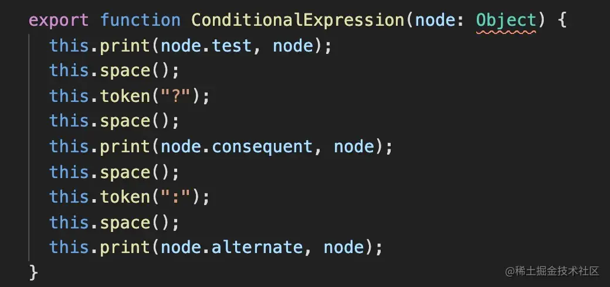

## generator的生成过程

当调用generator的方法时，会对每种类型的AST调用不同的方法

例如：



## sourceMap

### sourceMap的格式

```javascript
const map = {
  version: 3,
  file:"out.js",
  sourceRoot: "",
  sources: [
    "foo.js",
    "bar.js"
  ],
  names: [
    "src",
    "maps",
    "are",
    "fun"
  ],
  mappings: "AAgBC,SAAQ,CAAEA"
}
```

mappings 中的字符是由VLQ编码，一个字符就可以表示行列数

### sourceMap是如何生成的

每一个节点在transform的时候并不会去修改它的loc信息，所以转换完成后的节点中仍然保留了源码中的loc

在generate打印目标代码时会重新计算新的行列号，将二者关联即可生成sourceMap

具体生成 sourcemap 的过程是用 mozilla 维护的 source-map 这个包，其他工具做 sourcemap 的解析和生成也是基于这个包。

### source-map包的基本使用

```javascript
var map = new SourceMapGenerator({
  file: "source-mapped.js"
});

map.addMapping({
  generated: {
    line: 10,
    column: 35
  },
  source: "foo.js",
  original: {
    line: 33,
    column: 2
  },
  name: "christopher"
});

console.log(map.toString());
// '{"version":3,"file":"source-mapped.js",
//   "sources":["foo.js"],"names":["christopher"],"mappings":";;;;;;;;;mCAgCEA"}'
```
